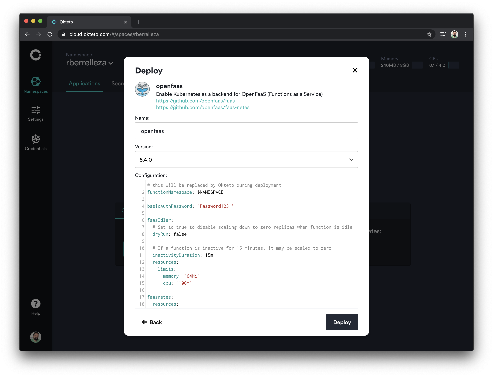
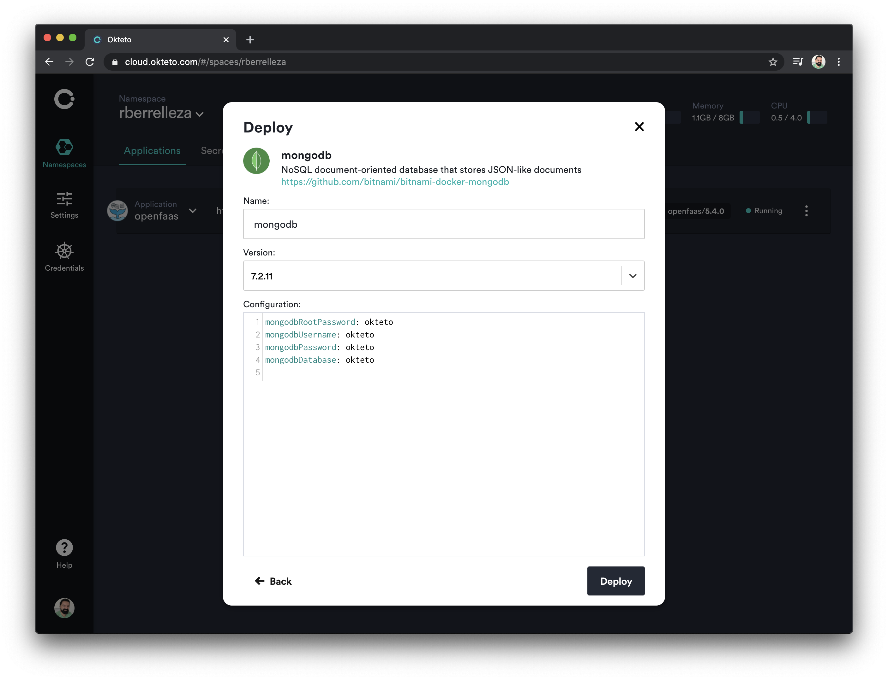

# Develop you Node functions with OpenFaaS and Okteto

In this post we'll talk about how to build a node-based function with [OpenFaaS](https://www.openfaas.com/) and Okteto.

## Prerequisites

1. Create a [free Okteto Cloud account](https://cloud.okteto.com)
1. Install the [OpenFaaS cli](https://docs.openfaas.com/cli/install/)
1. Docker running on your local machine
1. Download and configure your Okteto Cloud [Kubernetes credentials](https://okteto.com/docs/cloud/credentials)

## Steps

### Deploy your Initial Function

Login to Okteto Cloud and deploy your own instance of OpenFaaS. Don't forget to update the password!



Open a terminal, and export your github ID (e.g. rberrelleza)

```console
$ export GITHUBID=rberrelleza
```

Login to the Okteto Container Registry with `docker`. [Use your Okteto API token ](https://cloud.okteto.com/#/settings/setup) as the password.

```console
$ docker login registry.cloud.okteto.net -u $GITHUBID
```

```console
Password:
Login Succeeded
```

Once OpenFaaS is up and running, login to the gateway from your local computer.

```console
$ faas-cli login --gateway https://openfaas-ingress-$GITHUBID.cloud.okteto.net --password 'Password123!'
```

```console
Calling the OpenFaaS server to validate the credentials...
credentials saved for admin https://openfaas-ingress-rberrelleza.cloud.okteto.net
```

For this post, we are going to create a python function. We'll use `faas-cli` to create the basic skeleton, using the node12 template. This command will create a file called `hello.yml` with all the details of your function.

```console
$ faas-cli new --lang node12 --prefix registry.cloud.okteto.net/$GITHUBID --gateway https://openfaas-ingress-$GITHUBID.cloud.okteto.net hello
```

```console
...
...
Function created in folder: hello
Stack file written: hello.yml
```

Build and Deploy the first version of your function

```console
$ faas-cli up -f hello.yml
```

```console
...
...
Deployed. 202 Accepted.
URL: https://openfaas-ingress-rberrelleza.cloud.okteto.net/function/hello
```


The function is an `echo` function. You can try it out from the command line:

```console
$ curl -XGET https://openfaas-ingress-$GITHUBID.cloud.okteto.net/function/hello -d "hello"
```

```
hello
```


## Launch MongoDB

For the purpose of this demo, we are going to update our function to keep track of who attended our event. It needs to do the following:
- Access MongoDB
- On POST, take the body of the request and save in on mongodb
- On GET, return the list of attendees. 

You can deploy MongoDB with one click in Okteto Cloud, so we'll go with that. Browse back to Okteto Cloud and deploy your MongoDB instance. 



The MongoDB instance deployed by Okteto creates a kubernetes secret with the password. OpenFaaS supports directly mounting Kubernetes secrets in any function. We We are going to use this feature so we don't have to hard code any passwords. Add a `secrets` key to your `hello.yml` so it looks like this:

```yaml
version: 1.0
provider:
  name: openfaas
  gateway: https://openfaas-ingress-rberrelleza.cloud.okteto.net
functions:
  hello:
    lang: node12
    handler: ./hello
    image: registry.cloud.okteto.net/rberrelleza/hello:latest
    secrets:
      - mongodb
```

And update the function:

```console
$ faas-cli up -f hello.yml
```

```console
Deploying: hello.

Deployed. 202 Accepted.
URL: https://openfaas-ingress-rberrelleza.cloud.okteto.net/function/hello
```

## Develop your function

Now is time to add our new code. Normally, you would write the code locally, repackage your function, push the container, wait for the update... Instead, we are going to do it the Okteto style, directly in the cluster. First, create `hello/okteto.yml` and paste the content below, replacing  `{YOUR_GITHUBID}` with the name of the Github ID you use with Okteto.

```yaml
name: hello
image: registry.cloud.okteto.net/{YOUR_GITHUBID}/hello:dev
command:
- fwatchdog
workdir: /home/app/function
environment:
  - fprocess=nodemon /home/app/index.js
```

This file will tell `okteto` to convert your `hello` function into a development environment. It will keep the same configuration, permissions, volumes, etc... but `okteto` will automatically synchronize your code automatically into `/home/app/function`. 

You'll notice that the value of `image` is different that the one on `hello.yml`. This is because we are going to use a slightly [different image](hello/Dockerfile) than in prod to install the dev tools we need (nodemon, in this case). Build it via the `okteto build` command:

```
$ cd hello
$ okteto build -t registry.cloud.okteto.net/$GITHUBID/hello:dev -f dev.Dockerfile --build-arg NAMESPACE=$GITHUBID .
```

Start your development environment by running `okteto up`:

```console
$ okteto up
```

```console
 ✓  Development environment activated
 ✓  Files synchronized
    Namespace: rberrelleza
    Name:      hello

```

And start OpenFaaS' function manager  `fwatchdog` on your remote development environment:
```console
~/function $ fwatchdog
```

```console
Forking - nodemon [/home/app/index.js]
2020/04/30 19:01:06 Started logging stderr from function.
2020/04/30 19:01:06 Started logging stdout from function.
2020/04/30 19:01:06 OperationalMode: http
2020/04/30 19:01:06 Timeouts: read: 15s, write: 15s hard: 10s.
2020/04/30 19:01:06 Listening on port: 8080
2020/04/30 19:01:06 Writing lock-file to: /tmp/.lock
2020/04/30 19:01:06 Metrics listening on port: 8081
2020/04/30 19:01:06 stdout: [nodemon] 2.0.3
2020/04/30 19:01:06 stdout: [nodemon] to restart at any time, enter `rs`
2020/04/30 19:01:06 stdout: [nodemon] watching path(s): *.*
2020/04/30 19:01:06 stdout: [nodemon] watching extensions: js,mjs,json
2020/04/30 19:01:06 stdout: [nodemon] starting `node /home/app/index.js`
2020/04/30 19:01:07 stdout: OpenFaaS Node.js listening on port: 3000
```

At this point, we have the same function we had before, but in a live development environment. Validate that everything works by calling the function again from your local terminal:

```console
$ curl https://openfaas-ingress-$GITHUBID.cloud.okteto.net/function/hello -d "hello"
```

```
hello
```

Let's implement the first part of our new function. We'll change it so it returns and updates our list of attendees. Open `hello/handler.js` in your local IDE, and update it  to look like this:

```javascript
'use strict'
const attendees = [];
module.exports = async (event, context) => {
  if (event.method == "POST"){
    attendees.push(event.body.githubID);
    return context
    .status(204)
  } else if (event.method == "GET"){
    return context
    .status(200)
    .succeed(attendees)
  }  
}
```

Save the file, go back to your local terminal, and call the function again to register and attendee:

```console
$ curl https://openfaas-ingress-$GITHUBID.cloud.okteto.net/function/hello -H "Content-Type: application/json" -d '{"githubID": "rberrelleza"}'
```

And then do a GET to get the list:

```console
$ curl https://openfaas-ingress-$GITHUBID.cloud.okteto.net/function/hello
```

```console
[{"githubID": "rberrelleza"}]
```

As soon as you change the code  `okteto` synchronizes it to your remote development environment. And as soon as it's updated there, OpenFaaS hot reloads your code, giving you instant feedback on your code changes. I like instant feedback a lot.

One of my favorite things about building applications with Okteto is the fact that my remote development environment looks just like production. This means that I have access to the same features, APIs and access patterns that my app is going to use in production. In this case, we can to take advantage of Kubernetes and OpenFaaS' secrets from the very beginning. 

When you add a secret in OpenFaaS, it will be mounted inside the `/var/secrets/openfaas` folder in your function. Our development environment inherits all the configuration, so we can use the same mechanism to get the password. Let's update the code to get the password from that directory and create the mongoDB URI.

```javascript
'use strict'
var fs = require('fs');
var mongoSecret = fs.readFileSync('/var/openfaas/secrets/mongodb-password', 'utf8');

const attendees = [];
module.exports = async (event, context) => {
  if (event.method == "POST"){
    return context
    .status(200)
    .succeed(attendees)
  } else if (event.method == "GET"){
    return context
    .status(200)
    .succeed(attendees)
  }  
}
```

Finally, let's implement our read / write logic. To keep things simple, we'll assume that the body of the request contains the github ID of the attendee:

```javascript
'use strict'
var fs = require('fs');
const mongodb = require('mongodb');
const mongoSecret = fs.readFileSync('/var/openfaas/secrets/mongodb-password', 'utf8');
const db = 'okteto' // CHANGE! database name accordingly
const username = 'okteto' // CHANGE! username accordingly
const namespace = `genievot`// CHANGE! namespace name accordingly
const client = mongodb.MongoClient;

module.exports = async (event, context) => {
  // CHANGE! url accordingly
  const c = await client.connect(`mongodb://mongodb.${namespace}.svc.cluster.local:27017/${db}`,
    { user: username, password: mongoSecret, useUnifiedTopology: true });

  if (event.method == 'POST') {
    console.log(event.body)
    let r = await c.db(db).collection('attendees').insertOne({ 'githubID': event.body });
    if (1 == r.insertedCount) {
      return context
        .status(204);
    } else {
      return context
        .status(500);
    }
  } else if (event.method == 'GET') {
    const result = await c.db('okteto').collection('attendees').find().toArray();
    const list = [];
    result.forEach(a => list.push({ 'githubID': a.githubID }));
    return context
      .status(200)
      .succeed(result)
  } else {
    return context.status(405);
  }
}
```

Since we are adding a new dependency (`mongodb`), we'll have to install it into the dev environment. Go to your remote development environment, stop `fwatchdog` and `npm install` the new dependency.

```console
~ function $ npm install mongodb --save
```

```console
...
+ mongodb@3.5.7
added 20 packages from 11 contributors and audited 21 packages in 5.03s
found 0 vulnerabilities
```

> okteto's file synchronization features will automatically synchronize your `package.json` between your remote and local development environments. With this, your production image will automatically get it next time you build it.

And start `fwatchdog` again:

```console
~ function $ fwatchdog
```

```console
2020/04/25 07:40:33 Version: 0.18.1	SHA: b46be5a4d9d9d55da9c4b1e50d86346e0afccf2d
2020/04/25 07:40:33 Timeouts: read: 5s, write: 5s hard: 0s.
2020/04/25 07:40:33 Listening on port: 8080
2020/04/25 07:40:33 Writing lock-file to: /tmp/.lock
2020/04/25 07:40:33 Metrics listening on port: 8081
```

No we are ready for the final test. First, let's do a `POST` call to register a new attendee.

```console
$ curl -XPOST https://openfaas-ingress-$GITHUBID.cloud.okteto.net/function/hello -d "ramiro"
```

Call it a couple of times with different names. Once you are done, do a `GET` to get the final list of attendees.

```console
$ curl https://openfaas-ingress-$GITHUBID.cloud.okteto.net/function/hello
```

```json
[{"githubID": "ramiro"}, {"githubID": "cindy"}, {"githubID": "pablo"}, {"githubID": "ramon"}]
```

## Ship your Changes

Now that we are done developing, let's make our changes permanent. First, let's shutdown our remote development environment with the `okteto down` command:

```console
~ function $ exit
$ okteto down
```

```
 ✓  Development environment deactivated
 i  Run 'okteto push' to deploy your code changes to the cluster
```

> `okteto down` will restore your function to the state before we started developing. 

Finally, run `faas-cli up` one more time to build and deploy the final version of your function.

```console
$ cd ..
$ faas-cli up -f hello.yml
```

```console
Deploying: hello.

Deployed. 202 Accepted.
URL: https://openfaas-ingress-rberrelleza.cloud.okteto.net/function/hello
```

Check that everything worked by calling the function to get the list of attendees:

```console
$ curl https://openfaas-ingress-$GITHUBID.cloud.okteto.net/function/hello
```

```json
[{"githubID": "ramiro"}, {"githubID": "cindy"}, {"githubID": "ramon"}, {"githubID": "pablo"}]
```

## Conclusion

In this post we showed you how easy it is to develop [OpenFaaS](https://openfaas.io) functions with [Okteto](https://github.com/okteto/okteto) and [Okteto Cloud](https://cloud.okteto.com) 

First, we used Okteto Cloud to deploy dev instances of OpenFaaS and MongoDb with a single click, creating a realistic production-like environment for us to develop our function.

Then we used `okteto` to deploy a remote development environment for our function, with the same configuration we would use in production. There, we took advantage of okteto's  file synchronization and hot reloading features to get instant feedback as we updated our function.

Okteto Cloud is the best platform for building Cloud Native applications. Get started for free at https://okteto.com.
